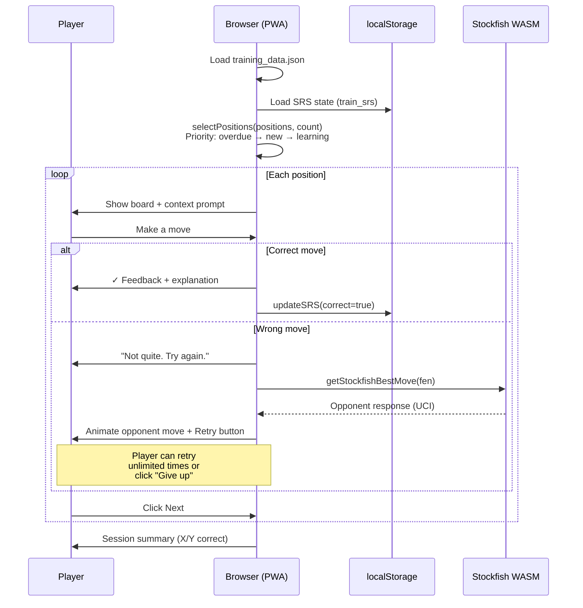
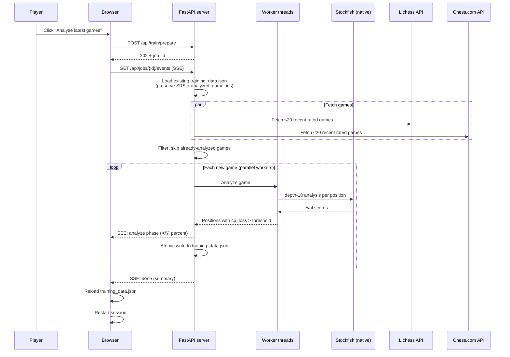
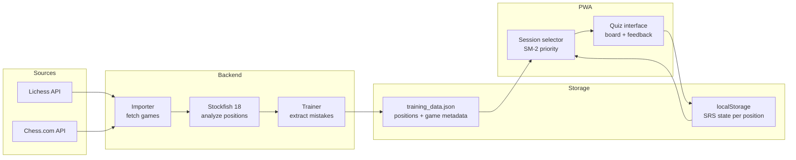
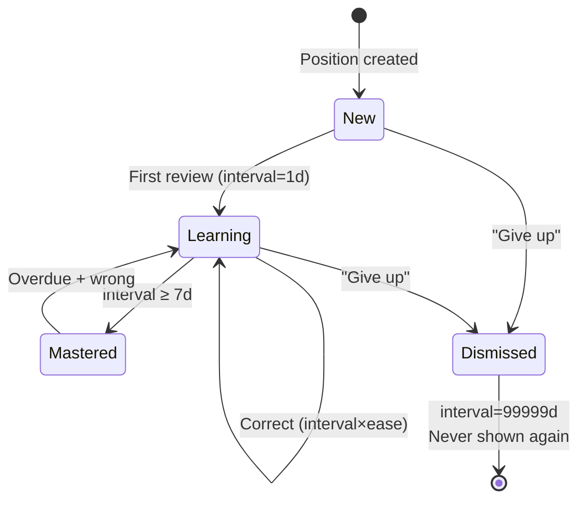
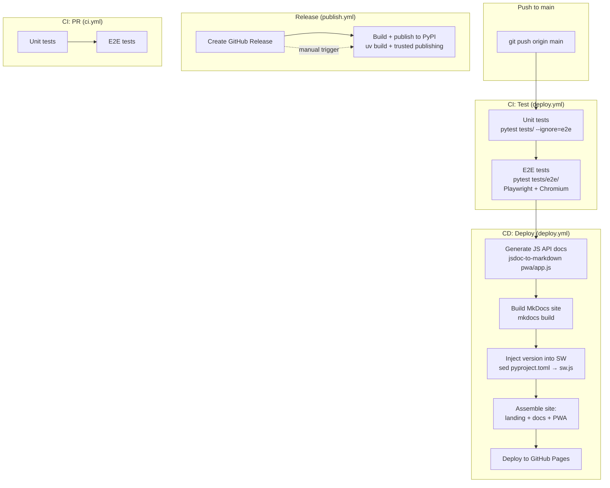
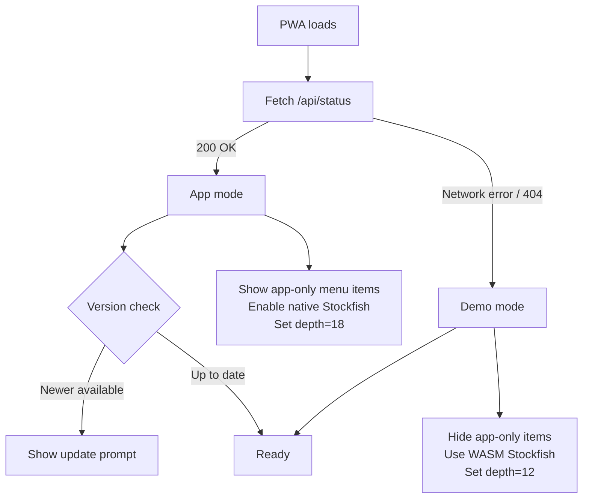
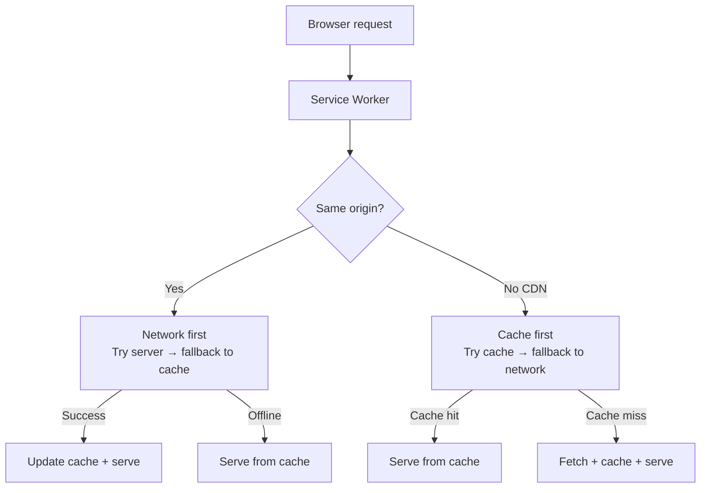

# Flows

This page documents how data and actions flow through the system — from the user's perspective, through the backend, and into storage.

## 1. Training session (PWA)

The core user-facing flow: the player practices positions extracted from their own games.



### Key details

- **Position selection** uses SM-2 spaced repetition: overdue positions first, then new (blunders prioritized), then learning (interval < 7 days). Mastered positions are skipped.
- **Intra-session repetition**: a correct first attempt reinserts the position 5 slots later for confirmation. A wrong answer reinserts 3 slots later.
- **Dismiss** ("Give up on this lesson") sets interval to 99999 days — the position never appears again.
- **SRS state** is stored per position ID in `localStorage` key `train_srs`.

---

## 2. Analyse latest games (app mode)

Fetches recent games, runs Stockfish analysis, and generates training positions.



### Key details

- **Incremental merge**: only new games are analyzed. Existing positions keep their SRS state.
- **Thresholds**: blunder ≥ 200cp, mistake ≥ 100cp, inaccuracy ≥ 50cp.
- **Parallelism**: N-1 CPU cores (ProcessPoolExecutor).
- **Crash safety**: atomic write after each game — if interrupted, partial results are saved.
- **Interrupt**: user can click the interrupt button → `POST /api/jobs/{id}/cancel` → saves progress so far.
- **Hardcoded defaults** (v0.3.8): 20 games per source, depth 18, no UI to customize.

---

## 3. Data lifecycle

How training data flows from chess platforms to the player's practice sessions.



### training_data.json structure

```
{
  version, generated, player: {lichess, chesscom},
  positions: [
    { id, fen, player_color, player_move, best_move,
      context, score_before, score_after, cp_loss, category,
      explanation, acceptable_moves, pv,
      game: { id, source, opponent, date, result },
      clock: { player, opponent },
      srs: { interval, ease, next_review, history } }
  ],
  analyzed_game_ids: [...]
}
```

### localStorage SRS state

```
train_srs: {
  "<position_id>": {
    interval, ease, repetitions, next_review,
    history: [{ date, correct, dismissed? }]
  }
}
```

---

## 4. SRS (Spaced Repetition) algorithm

The SM-2 variant used for scheduling position reviews.



| Outcome | Effect |
|---------|--------|
| Correct (1st rep) | interval = 1 day |
| Correct (2nd rep) | interval = 3 days |
| Correct (3rd+ rep) | interval = interval × ease |
| Wrong | interval = 1 day, repetitions = 0 |
| Ease adjustment | ease += 0.1 − (5−q)(0.08 + (5−q)×0.02), min 1.3 |

---

## 5. CI/CD pipeline

What happens when code is pushed.



### GitHub Pages site structure

```
site/
├── index.html          ← Landing page
├── docs/               ← MkDocs output (this documentation)
│   ├── index.html
│   ├── setup/
│   ├── cli/
│   ├── training/
│   ├── flows/
│   └── api/
└── train/              ← PWA (demo mode)
    ├── index.html
    ├── app.js
    ├── style.css
    ├── sw.js
    ├── manifest.json
    ├── training_data.json
    └── stockfish/
```

---

## 6. PWA mode detection

How the app decides whether it's running as a demo or as an installed application.



---

## 7. Service worker & caching

How the PWA handles offline access and updates.



### Key rules

- **Network-first** for same-origin assets: always serve fresh files from the server (important because `server.py` serves files dynamically).
- **Cache-first** for CDN resources (chessground, chess.js): these never change.
- `skipWaiting()` + `clients.claim()` ensure the new SW takes over immediately.
